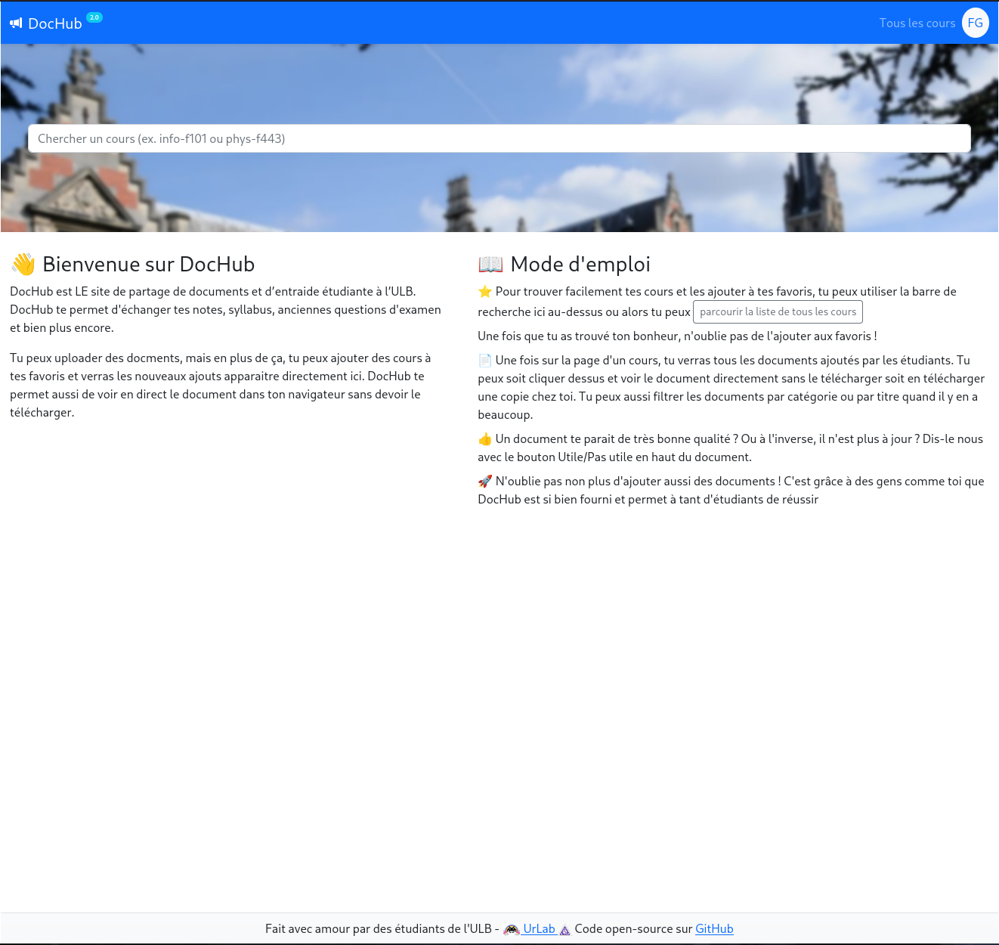
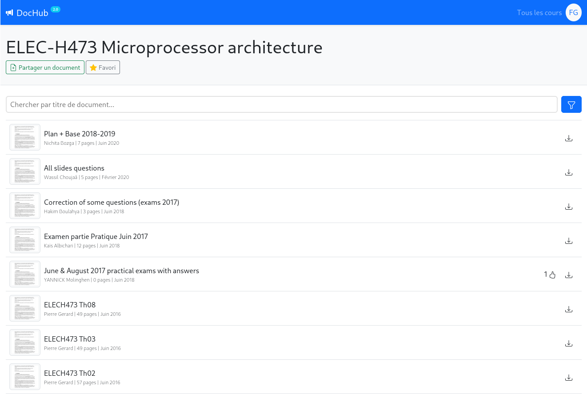
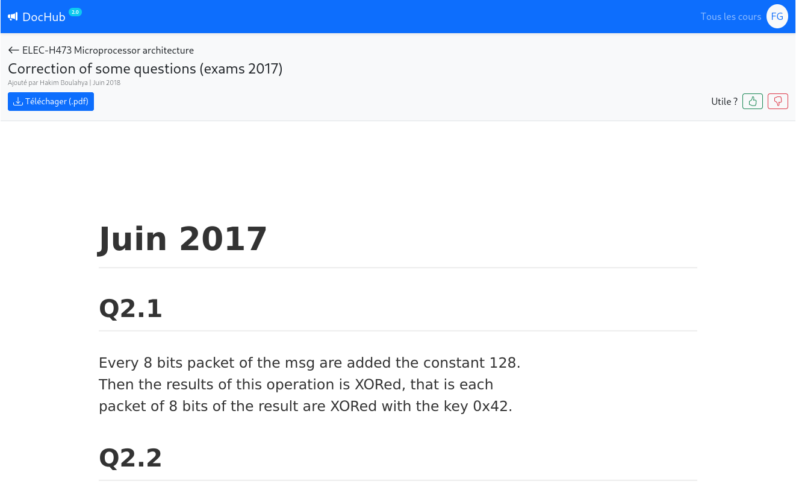

# DocHub

[](https://github.com/UrLab/dochub/blob/master/LICENSE)

DocHub is a website, written in django. It's main goal is to provide a space for students (for now form the [ULB](https://ulb.ac.be) university) to collaborate, help each other and distribute old exams and exercices.

There is a [live instance of DocHub](https://dochub.be) hosted by [UrLab](https://urlab.be) and the [Cercle Informatique](https://cerkinfo.be).

## Screenshots





## Tech

DocHub currently (Feb 2022) runs with Python 3.10 and Postgresql 14.

### Dependencies

```console
# Ubuntu
sudo apt-get install unoconv python3-dev ruby libtiff5-dev libjpeg-dev zlib1g-dev libfreetype6-dev liblcms2-dev libwebp-dev tcl8.6-dev tk8.6-dev python-tk mupdf-tools redis-server
sudo systemctl enable --now redis-server
# Fedora
sudo dnf install unoconv python-devel ruby mupdf redis
sudo systemctl enable --now redis
# Arch linux
sudo pacman -S unoconv ruby python mupdf-tools redis
sudo systemctl enable --now redis
```


### Installation

If you install the packages listed above and follow the installation steps exactly, you should have a running version
of DocHub on your machine. If it's not the case, **you are not the problem**, it means we have a bug.

Please open an issue with the output of your console and describe the problem you encountered, we **will** and will fix
it for you and the all the next users :rocket:

To create the virtual environment and install the requirements, run the following command:
```console
make install

# Alternatively, if you prefer to do it by hand
python3 -m venv ve
source ve/bin/activate
pip install -r requirements.txt
```

To create a database and fill it with some dummy data, run the following command. Observe the output, it
will tell you the credentials you can then use to log in.
```console
make database
```

### Run

This will have to be done each time you want to run DocHub.

```console
source ve/bin/activate
./manage.py runserver
```

Then go http://localhost:8000/

There will already be 2 users in the database, both with `test` as a password:

- $(USER) : your username on your machine
- blabevue

### Misc

#### Add another user to the db

```console
./manage.py createuser
```

#### Requirements

To add a requirement, write it in `requirements.in` file, and generate the requirements.txt file with the following command

```console
pip-compile
```

## Testing

Run only fast tests (total time < 2 sec) : not testing actual file conversions

```console
py.test -k "not slow"
```

Run all tests (~20 sec)

```console
py.test
```

## Contribute !

### Newcomer ? 👶

Check the issues tab and look and the issues tagged with the `easy pick` label. These are issues that are easy to fix and that will help you get started with the project. Once you feel comfortable with the codebase, you can tackle other issues.

### Guidelines

Assign yourself to an issue and start working on it *in your own branch*. If you have any questions or issue, feel free to ask them in the issue or tag some people you know can help.<br/>
If your PR is completed, ask for reviews either by mentioning the people you want to review your PR (You can also set them as reviewers on the right) or by asking on our irc channel **#urlab** on libera.chat.

### Any question ?

Come by #urlab on libera.chat and feel free to ask anything !

## License

Copyright 2012 - 2022, Cercle Informatique ASBL. All rights reserved.

This program is free software: you can redistribute it and/or modify it
under the terms of the GNU Affero General Public License as published by
the Free Software Foundation, either version 3 of the License, or (at
your option) any later version.

This software was made by hast, C4, ititou and rom1 at UrLab (https://urlab.be): ULB's hackerspace

[_Woop woop_](https://www.youtube.com/watch?v=SxSLU2-ERpk)
